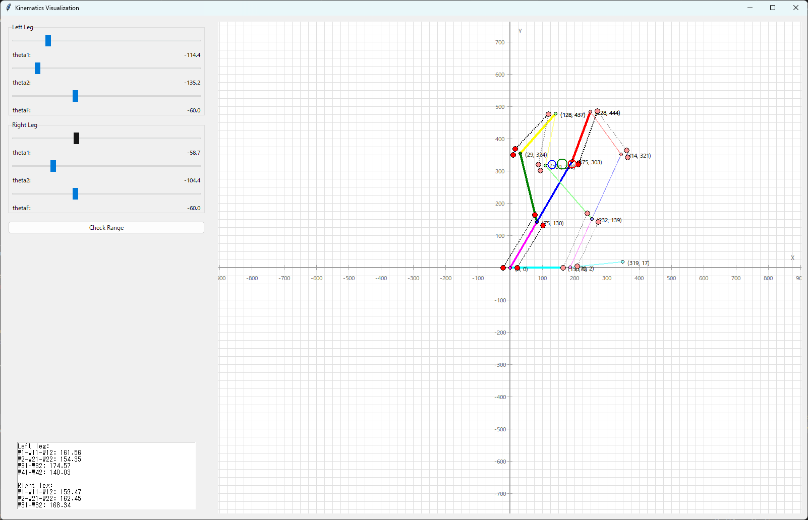

# symmetrical-five-bar-linkage

## Project Overview
This repository contains software for designing and testing symmetrical five-bar linkage mechanisms. It includes the implementation of forward kinematics, inverse kinematics, and analysis features.



## Directory Structure

```
symmetrical-five-bar-linkage/
├── docs/
│   ├── architect.md
│   ├── five_bar_linkage_documentation.md
│   ├── making_class.md
│   └── memo.md
├── examples/
├── image/
├── LICENSE
├── README.md
├── requirements.txt
├── src/
│   ├── __pycache__/
│   ├── gui/
│   │   ├── __init__.py
│   │   └── gui.py
│   ├── kinematics/
│   │   ├── __init__.py
│   │   ├── angle_table_4d.py
│   │   ├── extended_kinematics.py
│   │   ├── hip.py
│   │   ├── linkage_kinematics.py
│   │   └── transformation.py
│   ├── kinematics_app.py
│   ├── main.py
│   ├── requirements.txt
│   └── visualization/
├── tests/
│   ├── __init__.py
│   └── test_hip.py
```


## Installation
Clone the repository and install the required dependencies.
```bash
git clone https://github.com/yourusername/symmetrical-five-bar-linkage.git
cd symmetrical-five-bar-linkage
pip install -r requirements.txt
```

----
日本語

## プロジェクト概要
このリポジトリは、前後対称な五節リンクの設計および検証を行うためのソフトウェアを含んでいます。

## セットアップ
リポジトリをクローンし、必要な依存ライブラリをインストールします。
```bash
git clone https://github.com/yourusername/five-bar-linkage-design.git
cd five-bar-linkage-design
pip install -r requirements.txt
```

```
symmetrical-five-bar-linkage/
├── docs/
│   ├── architect.md
│   ├── five_bar_linkage_documentation.md
│   ├── making_class.md
│   └── memo.md
├── examples/
├── image/
├── LICENSE
├── README.md
├── requirements.txt
├── src/
│   ├── gui/
│   │   ├── __init__.py
│   │   └── gui.py
│   ├── kinematics/
│   │   ├── __init__.py
│   │   ├── angle_table_4d.py
│   │   ├── extended_kinematics.py
│   │   ├── hip.py
│   │   ├── linkage_kinematics.py
│   │   └── transformation.py
│   ├── kinematics_app.py
│   ├── main.py
│   ├── requirements.txt
│   └── visualization/
├── tests/
│   ├── __init__.py
│   └── test_hip.py

```