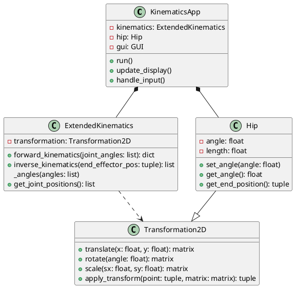

# 設計図

## ファイル構成
```
/kinematics_visualization
│
├── src/
│   ├── __init__.py
│   ├── main.py
│   ├── kinematics_app.py
│   ├── models/
│   │   ├── __init__.py
│   │   ├── extended_kinematics.py
│   │   ├── hip.py
│   │   └── transformation.py
│   ├── utils/
│   │   ├── __init__.py
│   │   └── math_utils.py
│   └── ui/
│       ├── __init__.py
│       └── gui_components.py
│
├── tests/
│   ├── __init__.py
│   ├── test_extended_kinematics.py
│   ├── test_hip.py
│   └── test_transformation.py
│
├── docs/
│   ├── design_document.md
│   └── user_manual.md
│
├── requirements.txt
├── setup.py
└── README.md
```

src/: メインのソースコードを含むディレクトリです。

main.py: アプリケーションのエントリーポイントです。
kinematics_app.py: メインのアプリケーションクラスです。
models/: コアロジッククラスを含みます。
utils/: ユーティリティ関数とヘルパークラスを含みます。
ui/: ユーザーインターフェース関連のコードを含みます。
tests/: アプリケーションの単体テストを含みます。

docs/: ドキュメントファイルを含みます。

design_document.md: 技術設計とアーキテクチャの記述します。
user_manual.md: アプリケーションの使用方法に関するユーザー向け説明書です。
requirements.txt: プロジェクトのPython依存関係をリストアップします。

setup.py: アプリケーションのパッケージング設定ファイルです。

README.md: プロジェクトの概要、セットアップ手順、基本的な使用方法を記載します。

この構造は関心事を分離し、プロジェクトをより整理された状態に保ち、保守しやすくします。また、一般的なPythonプロジェクトの規則に従っているため、他の開発者がプロジェクトで作業したり使用したりする際に馴染みやすいでしょう。

# クラス図

### KinematicsApp:

これはアプリケーションのメインクラスで、運動学の計算とGUIの更新を調整します。
ExtendedKinematics、Hip、およびGUIクラスのインスタンスを持ちます。
メソッドには run()、update_display()、handle_input() があります。

### ExtendedKinematics:

このクラスは運動学の計算を処理します。
座標変換のために Transformation2D オブジェクトを使用します。
メソッドには forward_kinematics()、inverse_kinematics()、update_joint_angles()、get_joint_positions() があります。

### Transformation2D:

このクラスは2D変換操作を提供します。
メソッドには translate()、rotate()、scale()、apply_transform() があります。

### Hip:

このクラスは Transformation2D を継承し、股関節を表現します。
角度と長さのプロパティがあります。
メソッドには set_angle()、get_angle()、get_end_position() があります。




このPlantUMLコードは、先ほど説明したクラス図を生成します。クラス間の関係は以下のように表現されています：

*-- は集約関係を示します（KinematicsAppがExtendedKinematicsとHipのインスタンスを持つ）。
..> は依存関係を示します（ExtendedKinematicsがTransformation2Dを使用する）。
--|> は継承関係を示します（HipがTransformation2Dを継承する）。
このクラス図は、運動学可視化アプリケーションの主要クラス間の構造と関係の高レベルな概要を提供します。

