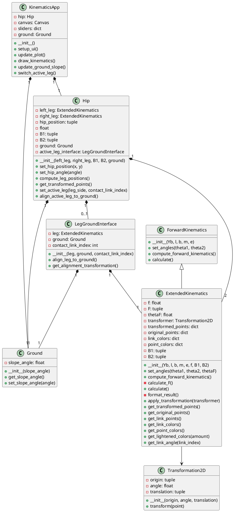

```plantuml

@startuml
class ForwardKinematics {
  +__init__(Yb, l, b, m, e)
  +set_angles(theta1, theta2)
  +compute_forward_kinematics()
  +calculate()
}

class ExtendedKinematics {
  -f: float
  -F: tuple
  -thetaF: float
  -transformer: Transformation2D
  -transformed_points: dict
  -original_points: dict
  -link_colors: dict
  -point_colors: dict
  -B1: tuple
  -B2: tuple
  +__init__(Yb, l, b, m, e, f, B1, B2)
  +set_angles(theta1, theta2, thetaF)
  +compute_forward_kinematics()
  -calculate_F()
  +calculate()
  -format_result()
  +apply_transformation(transformer)
  +get_transformed_points()
  +get_original_points()
  +get_link_points()
  +get_link_colors()
  +get_point_colors()
  +get_lightened_colors(amount)
  +get_link_angle(link_index)
}

class Transformation2D {
  -origin: tuple
  -angle: float
  -translation: tuple
  +__init__(origin, angle, translation)
  +transform(point)
}

class Ground {
  -slope_angle: float
  +__init__(slope_angle)
  +get_slope_angle()
  +set_slope_angle(angle)
}

class LegGroundInterface {
  -leg: ExtendedKinematics
  -ground: Ground
  -contact_link_index: int
  +__init__(leg, ground, contact_link_index)
  +align_leg_to_ground()
  +get_alignment_transformation()
}

class Hip {
  -left_leg: ExtendedKinematics
  -right_leg: ExtendedKinematics
  -hip_position: tuple
  - float
  -B1: tuple
  -B2: tuple
  -ground: Ground
  -active_leg_interface: LegGroundInterface
  +__init__(left_leg, right_leg, B1, B2, ground)
  +set_hip_position(x, y)
  +set_hip_angle(angle)
  +compute_leg_positions()
  +get_transformed_points()
  +set_active_leg(leg_side, contact_link_index)
  +align_active_leg_to_ground()
}

class KinematicsApp {
  -hip: Hip
  -canvas: Canvas
  -sliders: dict
  -ground: Ground
  +__init__()
  +setup_ui()
  +update_plot()
  +draw_kinematics()
  +update_ground_slope()
  +switch_active_leg()
}

ForwardKinematics <|-- ExtendedKinematics
ExtendedKinematics --> Transformation2D
Hip "1" *-- "2" ExtendedKinematics
Hip "1" *-- "1" Ground
Hip "1" *-- "0..1" LegGroundInterface
LegGroundInterface "1" *-- "1" ExtendedKinematics
LegGroundInterface "1" *-- "1" Ground
KinematicsApp "1" *-- "1" Hip
KinematicsApp "1" *-- "1" Ground
@enduml


```
