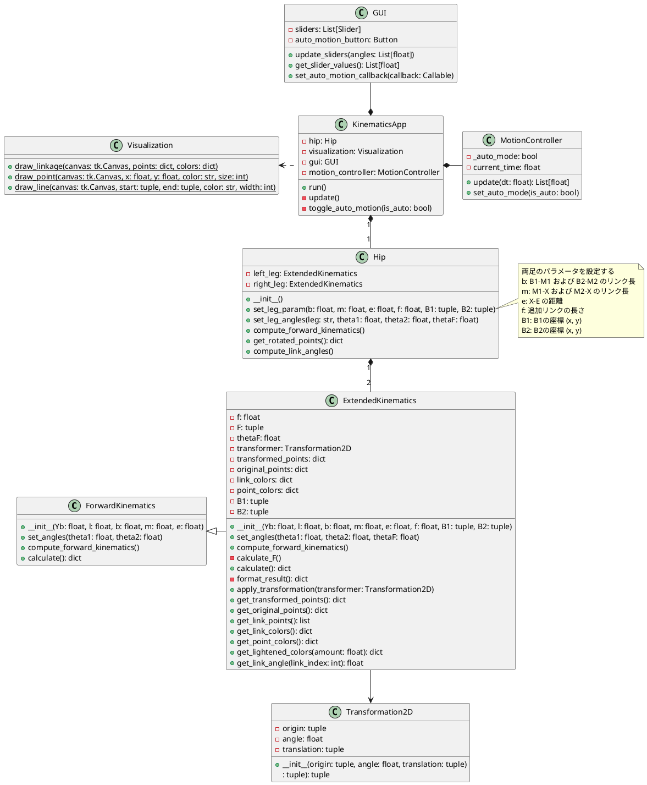

# クラス構造

以下は、2D運動学シミュレータのクラス構造を示すクラス図です。

```plantuml
@startuml
class ForwardKinematics {
  +__init__(Yb: float, l: float, b: float, m: float, e: float)
  +set_angles(theta1: float, theta2: float)
  +compute_forward_kinematics()
  +calculate(): dict
}

class ExtendedKinematics {
  -f: float
  -F: tuple
  -thetaF: float
  -transformer: Transformation2D
  -transformed_points: dict
  -original_points: dict
  -link_colors: dict
  -point_colors: dict
  -B1: tuple
  -B2: tuple
  +__init__(Yb: float, l: float, b: float, m: float, e: float, f: float, B1: tuple, B2: tuple)
  +set_angles(theta1: float, theta2: float, thetaF: float)
  +compute_forward_kinematics()
  -calculate_F()
  +calculate(): dict
  -format_result(): dict
  +apply_transformation(transformer: Transformation2D)
  +get_transformed_points(): dict
  +get_original_points(): dict
  +get_link_points(): list
  +get_link_colors(): dict
  +get_point_colors(): dict
  +get_lightened_colors(amount: float): dict
  +get_link_angle(link_index: int): float
}

class Transformation2D {
  -origin: tuple
  -angle: float
  -translation: tuple
  +__init__(origin: tuple, angle: float, translation: tuple)
  : tuple): tuple
}

class Hip {
  -left_leg: ExtendedKinematics
  -right_leg: ExtendedKinematics
  
  +__init__()
  +set_leg_param(b: float, m: float, e: float, f: float, B1: tuple, B2: tuple)
  +set_leg_angles(leg: str, theta1: float, theta2: float, thetaF: float)
  +compute_forward_kinematics()
  +get_rotated_points(): dict
  +compute_link_angles()
}

note right of Hip::set_leg_param
  両足のパラメータを設定する
  b: B1-M1 および B2-M2 のリンク長
  m: M1-X および M2-X のリンク長
  e: X-E の距離
  f: 追加リンクの長さ
  B1: B1の座標 (x, y)
  B2: B2の座標 (x, y)
end note

class KinematicsApp {
  - hip: Hip
  - visualization: Visualization
  - gui: GUI
  - motion_controller: MotionController
  + run()
  - update()
  - toggle_auto_motion(is_auto: bool)
}


class Visualization {
  +{static} draw_linkage(canvas: tk.Canvas, points: dict, colors: dict)
  +{static} draw_point(canvas: tk.Canvas, x: float, y: float, color: str, size: int)
  +{static} draw_line(canvas: tk.Canvas, start: tuple, end: tuple, color: str, width: int)
}

class GUI {
  - sliders: List[Slider]
  - auto_motion_button: Button
  + update_sliders(angles: List[float])
  + get_slider_values(): List[float]
  + set_auto_motion_callback(callback: Callable)
}

class MotionController {
  -_auto_mode: bool
  - current_time: float
  + update(dt: float): List[float]
  + set_auto_mode(is_auto: bool)
}

ForwardKinematics <|-r- ExtendedKinematics
ExtendedKinematics --> Transformation2D
Hip "1" *-d- "2" ExtendedKinematics
KinematicsApp "1" *-- "1" Hip
KinematicsApp .l.> Visualization
KinematicsApp *-u- GUI
KinematicsApp *-r- MotionController

@enduml

```

